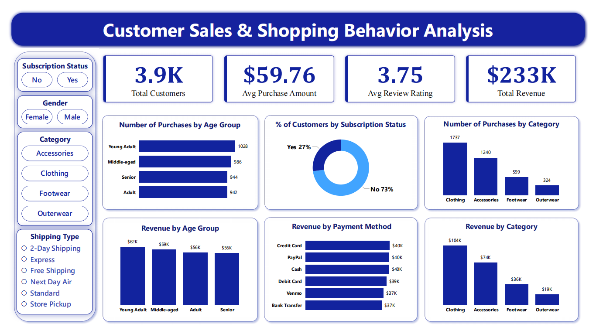

# Customer Sales & Shopping Behavior Analysis

## 📌 Project Overview
This project analyzes customer sales and shopping behavior using Python, SQL Server, and Power BI. It identifies customer purchasing patterns, sales trends, and business insights to support data-driven decision-making.

## 🛠️ Tools & Technologies
- Python (Pandas)
- SQL Server (SSMS)
- Power BI
- Jupyter Notebook

## 📂 Project Files
- Dataset (.csv)
- Python Notebook (.ipynb)
- SQL Queries (.sql)
- Power BI Dashboard (.pbix)
- Project Report (.pdf)

## 📊 Dashboard Preview

## 💡 Business Recommendations
- Focus on high-performing product categories.
- Reward loyal customers.
- Improve low-performing products.
- Plan seasonal promotions.
- Improve customer satisfaction.
